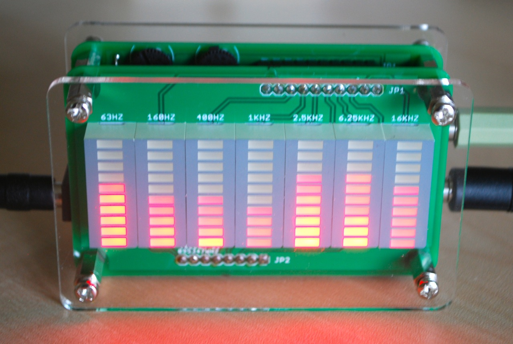
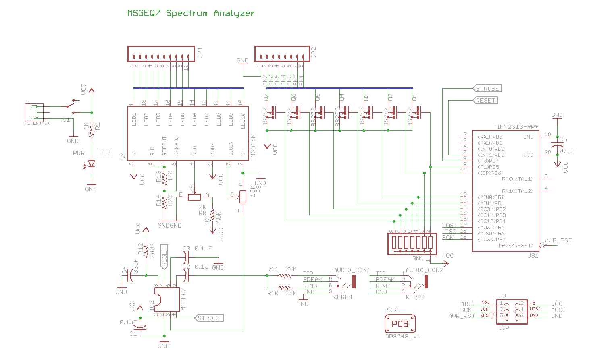
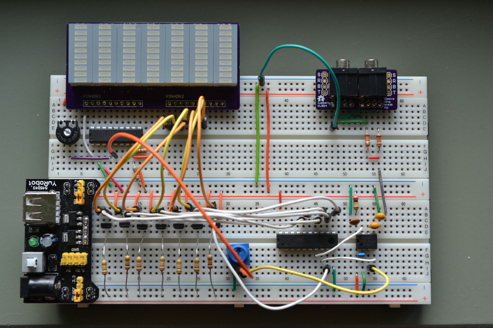

# MSGEQ7 based audio spectrum analyzer

This is a audio spectrum analyzer based on the msgeq7 using an lm3915 as the display driver and an attiny2313 for timing.

## Sandwiched boards in a "sick of beige" case

[Build instructions](kit-r1.md)

  

## Schematic

  

## Breadboard

  

## "Stereo" on a breadboard

Use two msgeq7 and lm3915's to handle the two audio channels independent from each other. One attiny2313 drives both channnels.

  

