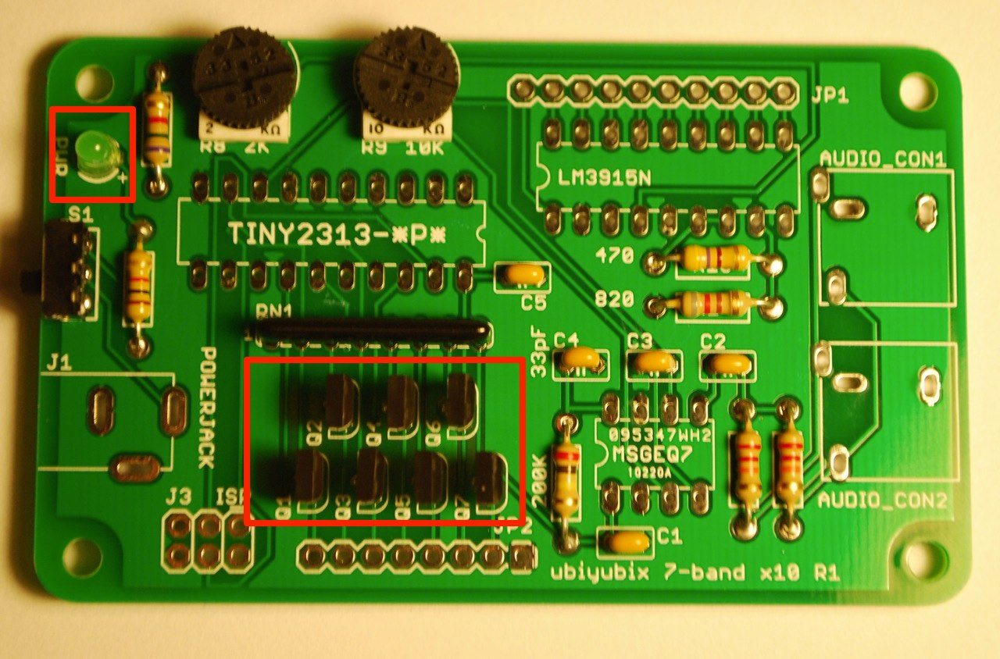
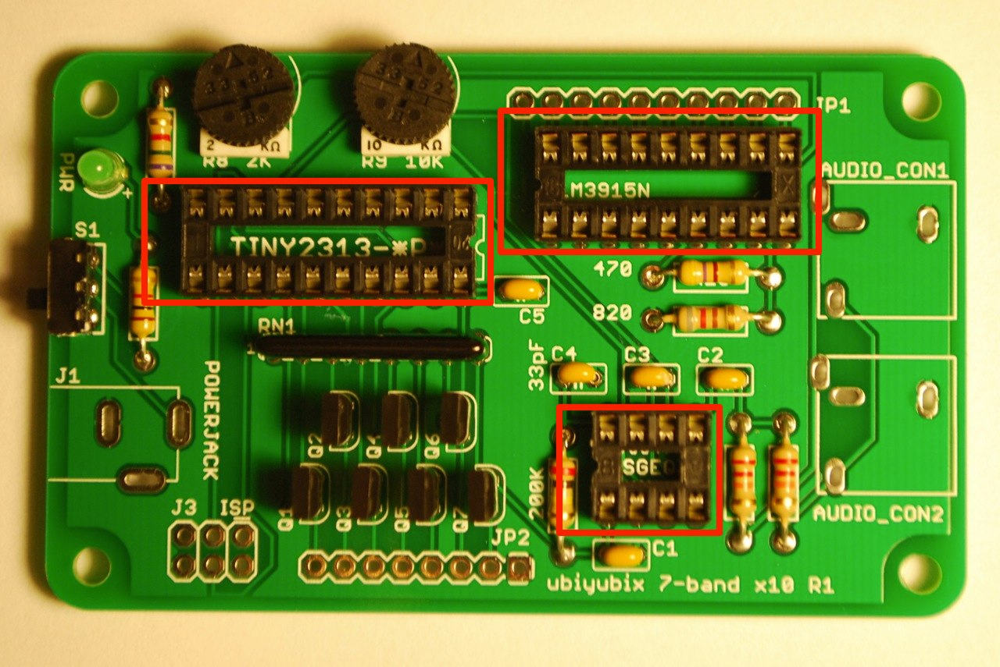
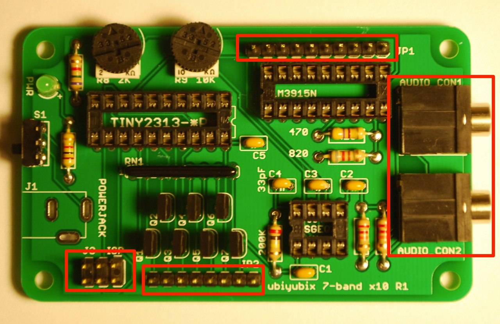
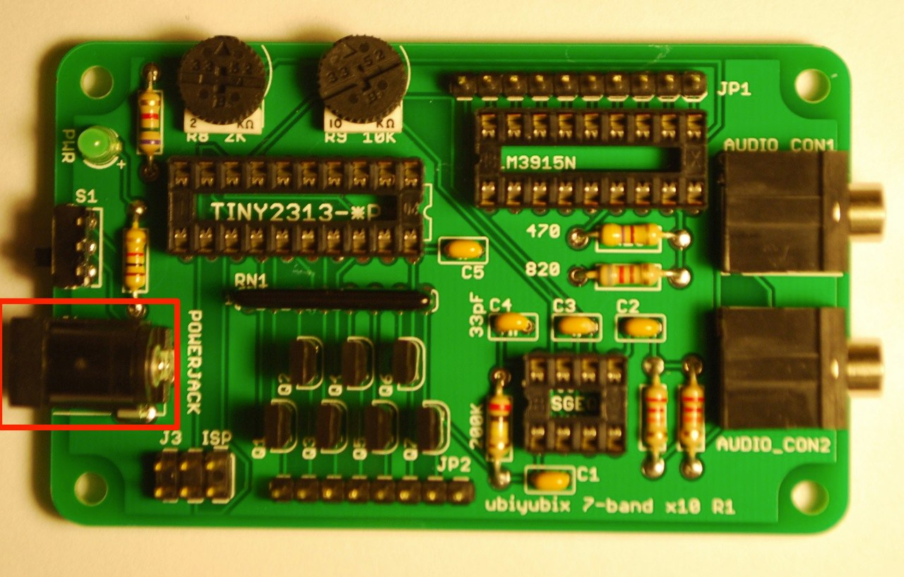

## Step 1 - Resistors and Capacitors

  

## Step 2 - Potentiometers, Resistor Network, Switch

  

## Step 3 - Transistors, Power LED

  

## Step 4 - IC Sockets

  

## Step 5 - Audio Sockets, Pin Headers

  

## Step 6 - Power Jack

  

## Step 7 - 10 Segment Bar Graph

  

